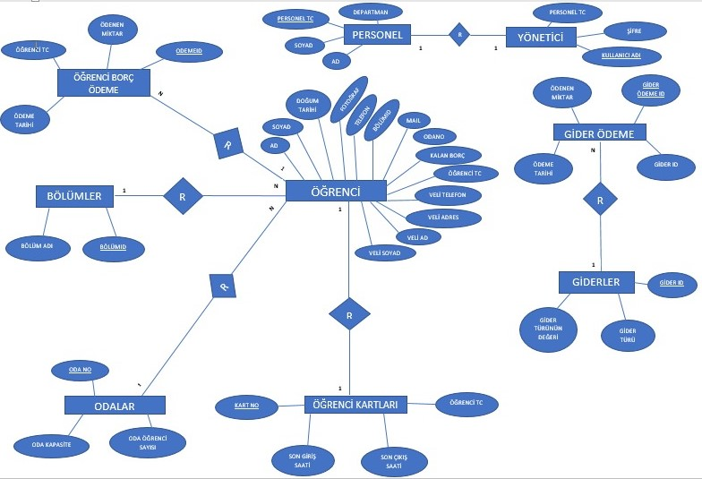
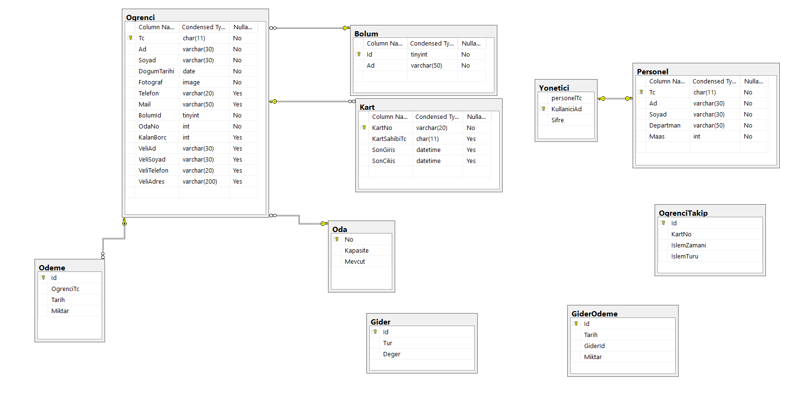

##### To Read English : [English README](/README.EN.md)

# YurtOtomasyonu 
C# ve SQL Server ile geliştirilen öğrenci yurtları için bir otomasyon.

## Giriş Penceresi

## Ana Sayfa

## Sekmeler

### Öğrenciler

#### Öğrenci Kayıt

#### Öğrenci Güncelle

#### Öğrenci Sil

#### Öğrenci Listesi

### Bölümler

#### Bölüm İşlemleri

### Ödemeler

#### Ödeme Al

### Gidereler

#### Gider Ekle

#### Giderler Listesi

### İstatistikler

#### Gider İstatistikleri

#### Gelir İstatistikleri

### Personel

#### Yönetici İşlemleri

#### Personel İşlemleri

### Öğrenci Takip

Bu özelliği kullanabilmek için Arduino ve RC522 RFID kart okuyucuya sahip olmalısınız. 
Arduino'ya yüklenecek kodları additional klasorünün altında VTYS klasöründe bulabilirsiniz.

#### Giriş/Çıkış Kontrol

#### Kart Ekle

### Erişim Kolaylığı

# EKLER 

### ER Diyagramı 
 
### Tablolar Arası İlişkiler 

## Ortaklar

### Ahmet Ekmel YEŞİLYURT ---> https://github.com/AhmetEkmell
### Harun AĞCA ----------------> https://github.com/HarunAGCA
### Fahrettin VARLIK -----------> https://github.com/fahrettin2323

