# YurtOtomasyonu
C# ve SQL Server ile geliştirilen öğrenci yurtları için bir otomasyon.

## Giriş Penceresi
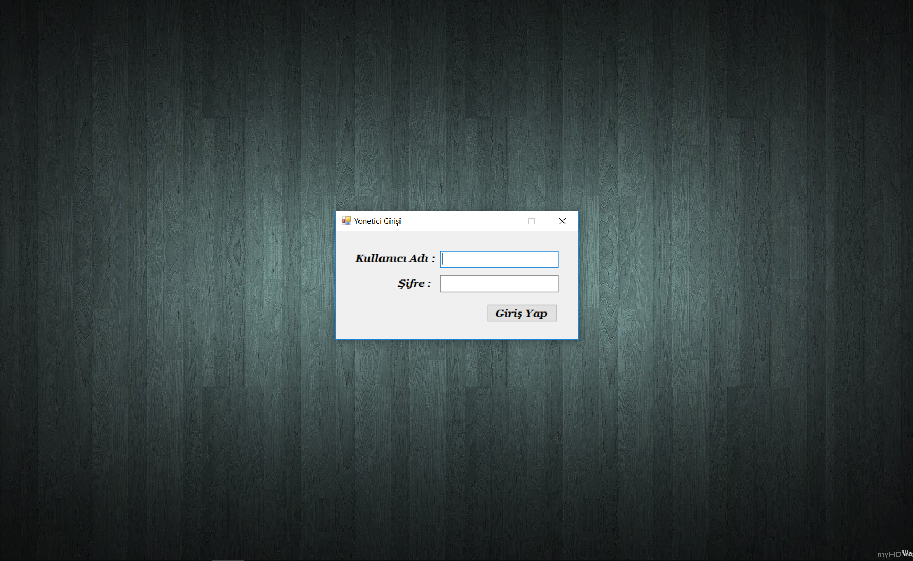

## Ana Sayfa

## Sekmeler

### Öğrenciler
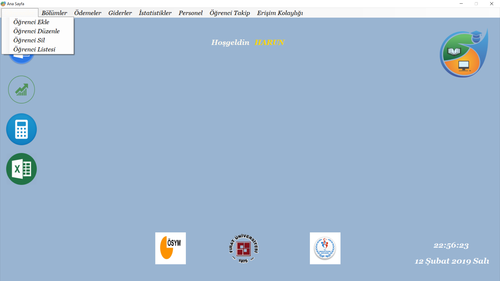
#### Öğrenci Kayıt

#### Öğrenci Güncelle
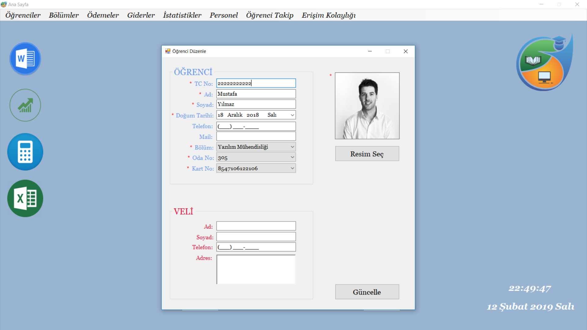
#### Öğrenci Sil
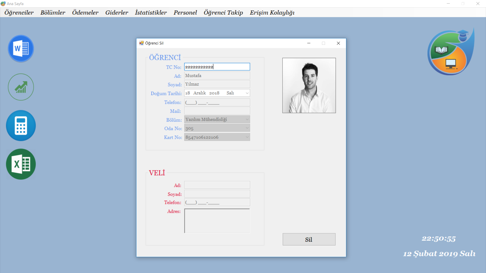
#### Öğrenci Listesi
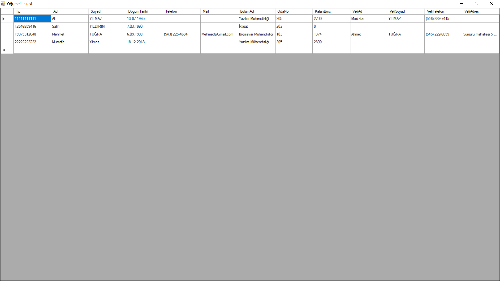

### Bölümler
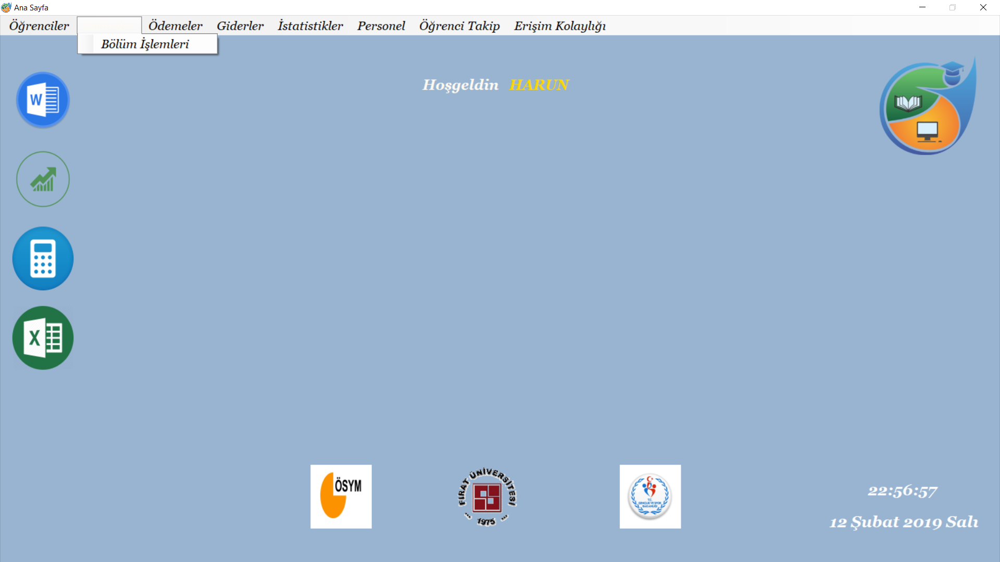
#### Bölüm İşlemleri

### Ödemeler
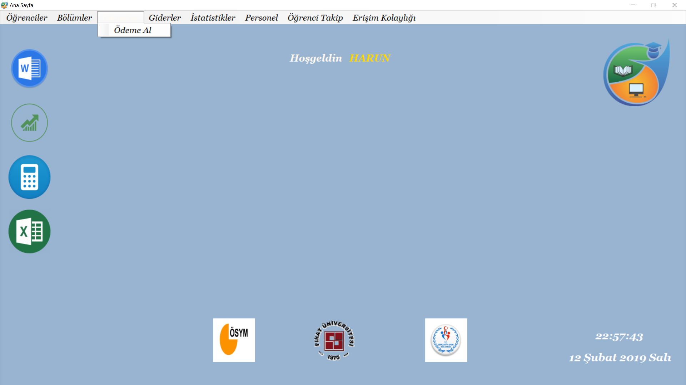
#### Ödeme Al
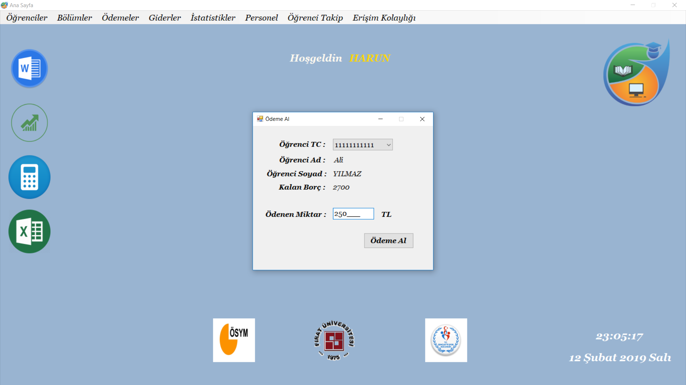

### Gidereler

#### Gider Ekle

#### Giderler Listesi

### İstatistikler
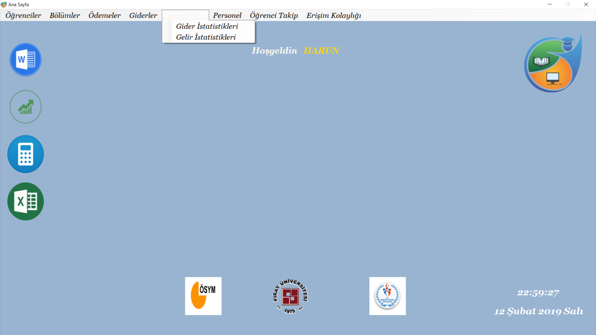
#### Gider İstatistikleri

#### Gelir İstatistikleri

### Personel

#### Yönetici İşlemleri
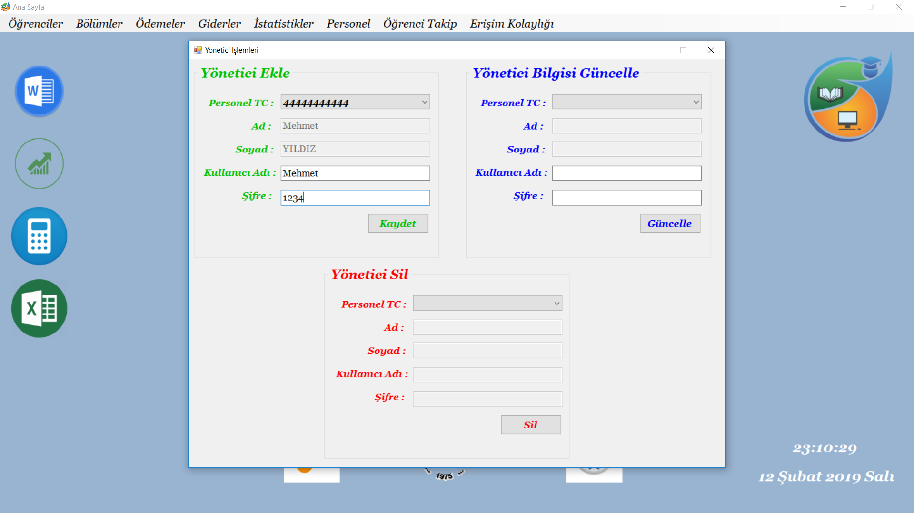
#### Personel İşlemleri
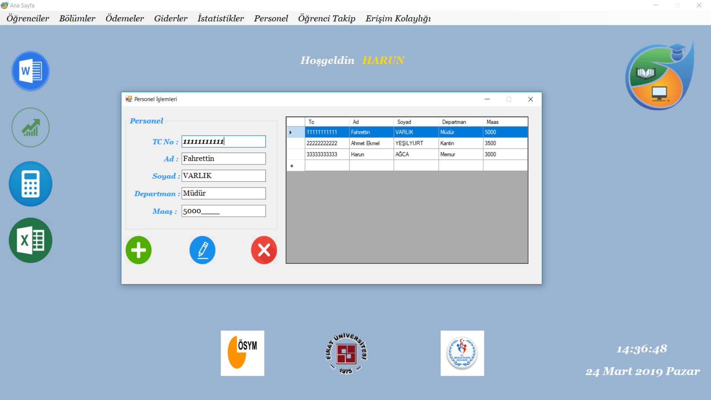

### Öğrenci Takip
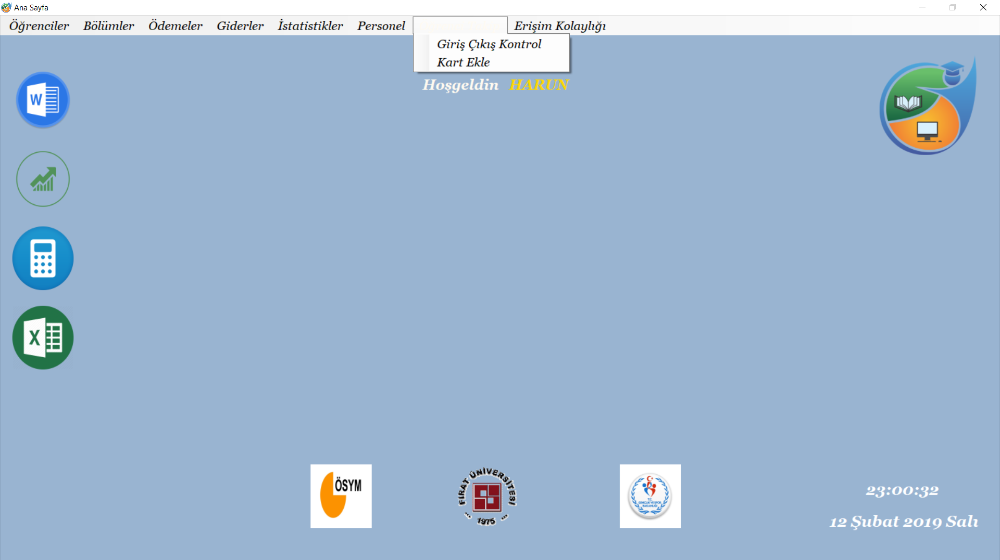
#### Giriş/Çıkış Kontrol

#### Kart Ekle
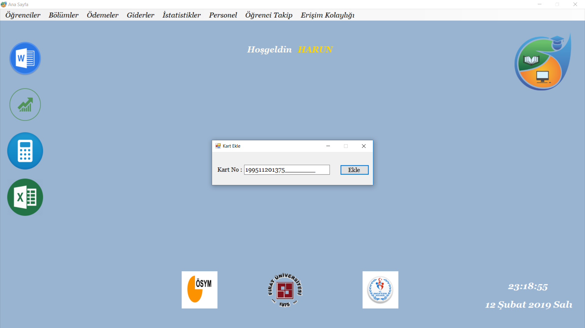

### Erişim Kolaylığı
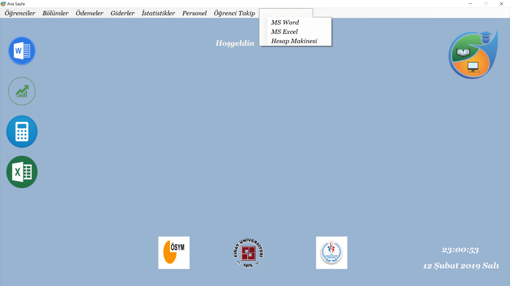

## Ortaklar

### Ahmet Ekmel YEŞİLYURT ---> 
### Harun AĞCA --------------> https://github.com/HarunAGCA
### Fahrettin VARLIK -------->

