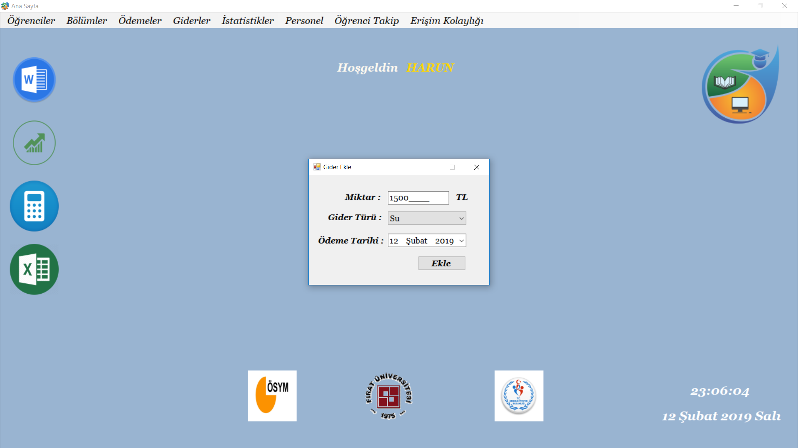

# YurtOtomasyonu
An automation for student dorms that developed with C# and SQL Server.

## Login Window

## Main Page

## Tabs

### Students

#### Student Register

#### Update Student

#### Delete Student

#### Student List

### Departments

#### Department Operations

### Payments

#### Receive Payment

### Expenses 

#### Add Expenses

#### Expenses List

### Statistics

#### Expense Statistics

#### Earning Statistics

### Employee

#### Admin Operations

#### Employee Operations

### Student Tracking

#### Login/Logout Control

#### Add Card

### Accessibility

## Contributors

### Ahmet Ekmel YEŞİLYURT ---> 
### Harun AĞCA --------------> https://github.com/HarunAGCA
### Fahrettin VARLIK -------->

